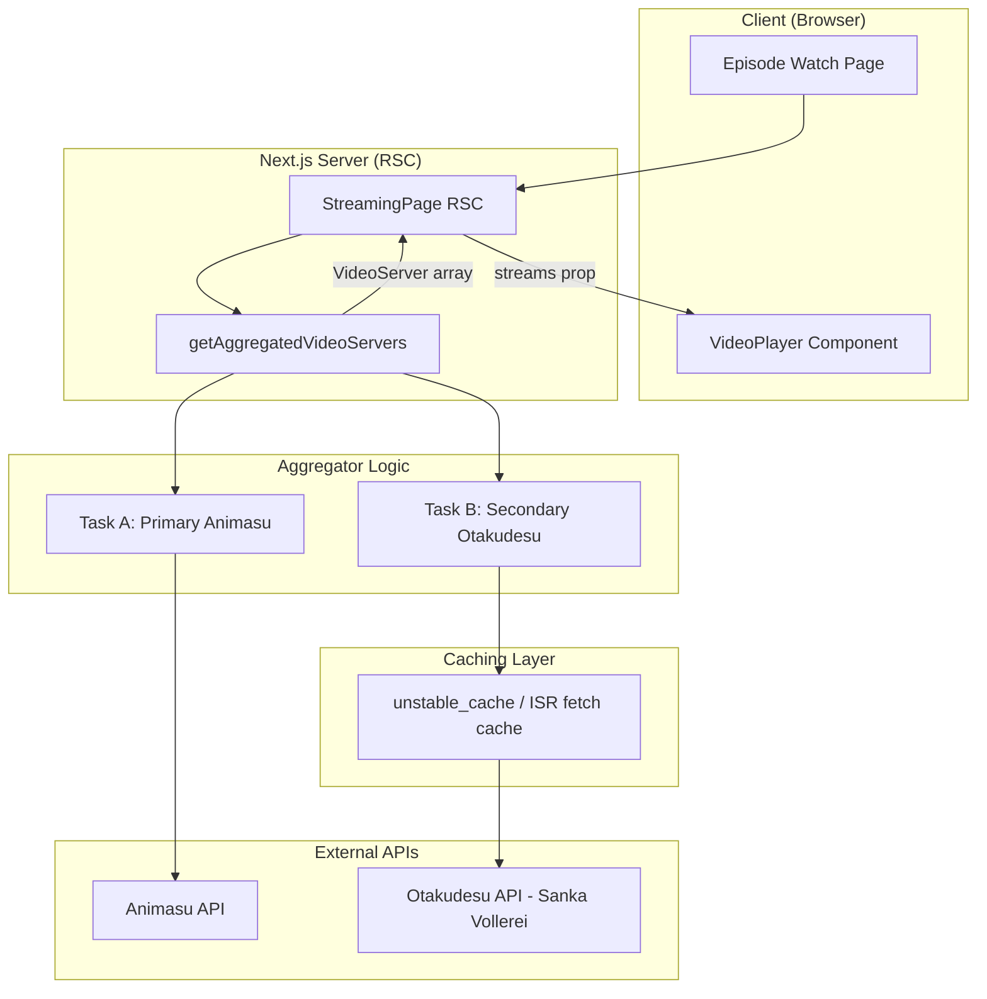
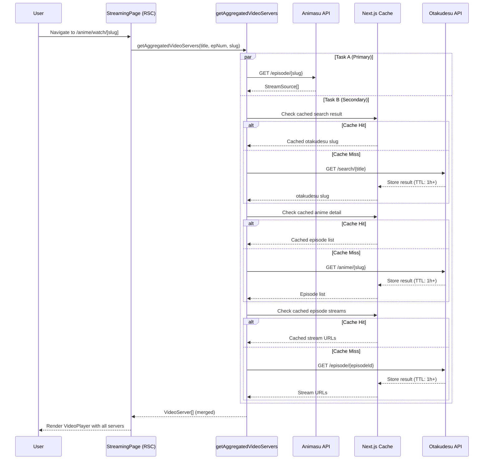
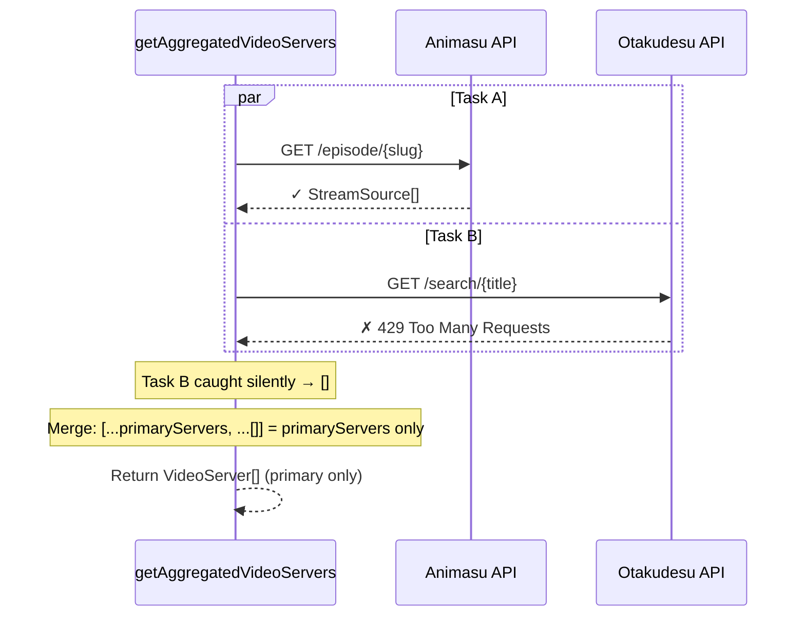

# Design Document: Multi-Server Video Aggregator

## Overview

This feature integrates a secondary anime streaming API (Otakudesu via Sanka Vollerei) alongside the existing primary API (Animasu) to provide users with multiple video server options per episode. The aggregator fetches from both APIs concurrently using `Promise.allSettled`, merges results into a unified `VideoServer[]` array, and presents all available servers in the existing VideoPlayer dropdown.

The secondary API has a strict rate limit of 50 requests/minute, so all Otakudesu calls are aggressively cached using Next.js `unstable_cache` with a minimum 1-hour TTL. The system is designed to be fully fault-tolerant: if the secondary API fails for any reason (429, 404, network error), the user still sees primary servers without interruption.

## Architecture



## Sequence Diagrams

### Main Flow: Episode Page Load



### Error Handling Flow: Secondary API Failure



## Components and Interfaces

### Component 1: VideoServer Type

**Purpose**: Unified type representing a streaming server from any provider.

**Interface**:
```typescript
export interface VideoServer {
  provider: string;  // e.g., "Animasu", "Otakudesu"
  quality: string;   // e.g., "HD", "480p", "Default"
  url: string;       // The iframe/video URL
}
```

**Responsibilities**:
- Provide a common shape for streams from any API source
- Enable the UI to display provider and quality info in the server selector

### Component 2: Otakudesu API Response Types

**Purpose**: Type definitions for the secondary API responses.

**Interface**:
```typescript
// Search response
interface OtakudesuSearchResult {
  slug: string;
  title: string;
  // other fields from API (poster, etc.)
}

interface OtakudesuSearchResponse {
  status: string;
  data: OtakudesuSearchResult[];
}

// Anime detail response
interface OtakudesuEpisodeEntry {
  eps: string;         // Episode number as string
  slug: string;        // Episode slug / ID
  episodeId: string;   // Used for episode fetch
}

interface OtakudesuDetailResponse {
  status: string;
  data: {
    info: {
      episodeList: OtakudesuEpisodeEntry[];
    };
  };
}

// Episode streaming response
interface OtakudesuQuality {
  quality: string;
  url: string;
}

interface OtakudesuEpisodeResponse {
  status: string;
  data: {
    defaultStreamingUrl: string;
    server: {
      qualities: OtakudesuQuality[];
    };
  };
}
```

### Component 3: Aggregator Function

**Purpose**: Orchestrates concurrent fetching from both APIs and merges results.

**Interface**:
```typescript
export async function getAggregatedVideoServers(
  animeTitle: string,
  currentEpisodeNumber: number | string,
  primaryEpisodeSlug: string
): Promise<VideoServer[]>
```

**Responsibilities**:
- Fetch primary servers via existing `getEpisodeData`
- Fetch secondary servers via cached Otakudesu pipeline
- Use `Promise.allSettled` for concurrent, fault-tolerant execution
- Merge results into a single flat `VideoServer[]`
- Never throw — always return at least an empty array

### Component 4: Otakudesu Cached Fetchers

**Purpose**: Individual cached fetch functions for each Otakudesu API step.

**Interface**:
```typescript
// Cached search
async function searchOtakudesu(title: string): Promise<OtakudesuSearchResult | null>

// Cached anime detail
async function getOtakudesuDetail(slug: string): Promise<OtakudesuEpisodeEntry[]>

// Cached episode streams
async function getOtakudesuEpisode(episodeId: string): Promise<VideoServer[]>
```

**Responsibilities**:
- Wrap each API call with `unstable_cache` or ISR `fetch` caching (TTL ≥ 3600s)
- Handle errors gracefully, returning null/empty on failure
- Respect the 50 req/min rate limit through aggressive caching

### Component 5: Updated VideoPlayer

**Purpose**: Display servers from multiple providers in the dropdown.

**Interface**:
```typescript
interface VideoPlayerProps {
  streams: VideoServer[];  // Changed from StreamSource[]
  title: string;
}
```

**Responsibilities**:
- Render provider + quality labels in the server selector dropdown
- Maintain backward compatibility with existing UI behavior

## Data Models

### Model 1: VideoServer

```typescript
export interface VideoServer {
  provider: string;
  quality: string;
  url: string;
}
```

**Validation Rules**:
- `provider` must be a non-empty string
- `quality` must be a non-empty string
- `url` must be a valid URL string (starts with http:// or https://)

### Model 2: StreamSource (Existing — to be adapted)

```typescript
// Current type (will remain for backward compat with primary API response)
export interface StreamSource {
  name: string;
  url: string;
}
```

**Mapping Rule**:
- `StreamSource` → `VideoServer`: `{ provider: "Animasu", quality: s.name, url: s.url }`

### Model 3: Otakudesu API Config

```typescript
// Added to config.ts
export const OTAKUDESU_API_URL = "https://www.sankavollerei.com/anime";
export const OTAKUDESU_CACHE_TTL = 3600; // 1 hour minimum
```

## Key Functions with Formal Specifications

### Function 1: getAggregatedVideoServers()

```typescript
async function getAggregatedVideoServers(
  animeTitle: string,
  currentEpisodeNumber: number | string,
  primaryEpisodeSlug: string
): Promise<VideoServer[]>
```

**Preconditions:**
- `animeTitle` is a non-empty string
- `currentEpisodeNumber` is a positive integer or numeric string
- `primaryEpisodeSlug` is a non-empty string matching a valid Animasu episode slug

**Postconditions:**
- Returns a `VideoServer[]` (may be empty, never throws)
- If primary API succeeds, result contains at least the primary servers
- If secondary API succeeds, result contains additional Otakudesu servers appended after primary
- Order: primary servers first, secondary servers last
- Each element has non-empty `provider`, `quality`, and `url` fields

**Loop Invariants:** N/A

### Function 2: searchOtakudesu()

```typescript
async function searchOtakudesu(title: string): Promise<OtakudesuSearchResult | null>
```

**Preconditions:**
- `title` is a non-empty string
- Function is called within Next.js server context (for caching)

**Postconditions:**
- Returns the first matching search result, or `null` if no match / error
- Result is cached for at least `OTAKUDESU_CACHE_TTL` seconds
- Never throws — catches all errors and returns `null`

**Loop Invariants:** N/A

### Function 3: getOtakudesuDetail()

```typescript
async function getOtakudesuDetail(slug: string): Promise<OtakudesuEpisodeEntry[]>
```

**Preconditions:**
- `slug` is a non-empty string (valid Otakudesu anime slug)

**Postconditions:**
- Returns the episode list array from the anime detail
- Returns empty array `[]` on any error
- Result is cached for at least `OTAKUDESU_CACHE_TTL` seconds
- Never throws

**Loop Invariants:** N/A

### Function 4: getOtakudesuEpisode()

```typescript
async function getOtakudesuEpisode(episodeId: string): Promise<VideoServer[]>
```

**Preconditions:**
- `episodeId` is a non-empty string (valid Otakudesu episode slug)

**Postconditions:**
- Returns `VideoServer[]` with provider set to `"Otakudesu"`
- Always includes `defaultStreamingUrl` as a server with quality `"Default"` (if available)
- May include additional servers from `data.server.qualities`
- Returns empty array `[]` on any error
- Result is cached for at least `OTAKUDESU_CACHE_TTL` seconds
- Never throws

**Loop Invariants:** N/A

### Function 5: mapStreamSourcesToVideoServers()

```typescript
function mapStreamSourcesToVideoServers(streams: StreamSource[]): VideoServer[]
```

**Preconditions:**
- `streams` is a valid `StreamSource[]` (may be empty)

**Postconditions:**
- Returns `VideoServer[]` of same length as input
- Each element has `provider: "Animasu"`, `quality: stream.name`, `url: stream.url`
- Pure function — no side effects

**Loop Invariants:**
- For index `i` in iteration: `result[i].url === streams[i].url`

## Algorithmic Pseudocode

### Main Aggregation Algorithm

```typescript
async function getAggregatedVideoServers(
  animeTitle: string,
  currentEpisodeNumber: number | string,
  primaryEpisodeSlug: string
): Promise<VideoServer[]> {
  // Step 1: Define concurrent tasks
  const taskA = async (): Promise<VideoServer[]> => {
    const episode = await getEpisodeData(primaryEpisodeSlug);
    return mapStreamSourcesToVideoServers(episode.streams);
  };

  const taskB = async (): Promise<VideoServer[]> => {
    return await fetchOtakudesuServers(animeTitle, currentEpisodeNumber);
  };

  // Step 2: Execute concurrently with fault tolerance
  const [resultA, resultB] = await Promise.allSettled([taskA(), taskB()]);

  // Step 3: Extract successful results
  const primaryServers = resultA.status === "fulfilled" ? resultA.value : [];
  const secondaryServers = resultB.status === "fulfilled" ? resultB.value : [];

  // Step 4: Merge and return
  return [...primaryServers, ...secondaryServers];
}
```

### Secondary API Pipeline Algorithm

```typescript
async function fetchOtakudesuServers(
  animeTitle: string,
  episodeNumber: number | string
): Promise<VideoServer[]> {
  // Step 1: Search for anime (cached)
  const searchResult = await searchOtakudesu(animeTitle);
  if (!searchResult) return [];

  // Step 2: Get anime detail with episode list (cached)
  const episodes = await getOtakudesuDetail(searchResult.slug);
  if (episodes.length === 0) return [];

  // Step 3: Find matching episode by number
  const epNum = String(episodeNumber);
  const matchedEpisode = episodes.find((ep) => ep.eps === epNum);
  if (!matchedEpisode) return []; // OVA mismatch, etc.

  // Step 4: Fetch episode streaming data (cached)
  const servers = await getOtakudesuEpisode(matchedEpisode.episodeId || matchedEpisode.slug);
  return servers;
}
```

### Caching Strategy Algorithm

```typescript
import { unstable_cache } from "next/cache";

// Each function is wrapped with unstable_cache for aggressive caching
const searchOtakudesu = unstable_cache(
  async (title: string): Promise<OtakudesuSearchResult | null> => {
    try {
      const encoded = encodeURIComponent(title);
      const res = await nimeFetch(
        `${OTAKUDESU_API_URL}/search/${encoded}`,
        false // disable ISR double-cache; unstable_cache handles it
      );
      if (!res.ok) return null;
      const json: OtakudesuSearchResponse = await res.json();
      return json.data?.[0] ?? null;
    } catch {
      return null;
    }
  },
  ["otakudesu-search"],       // cache key prefix
  { revalidate: 3600 }        // 1 hour TTL
);

const getOtakudesuDetail = unstable_cache(
  async (slug: string): Promise<OtakudesuEpisodeEntry[]> => {
    try {
      const res = await nimeFetch(
        `${OTAKUDESU_API_URL}/anime/${slug}`,
        false
      );
      if (!res.ok) return [];
      const json: OtakudesuDetailResponse = await res.json();
      return json.data?.info?.episodeList ?? [];
    } catch {
      return [];
    }
  },
  ["otakudesu-detail"],
  { revalidate: 3600 }
);

const getOtakudesuEpisode = unstable_cache(
  async (episodeId: string): Promise<VideoServer[]> => {
    try {
      const res = await nimeFetch(
        `${OTAKUDESU_API_URL}/episode/${episodeId}`,
        false
      );
      if (!res.ok) return [];
      const json: OtakudesuEpisodeResponse = await res.json();

      const servers: VideoServer[] = [];

      // Default streaming URL
      if (json.data?.defaultStreamingUrl) {
        servers.push({
          provider: "Otakudesu",
          quality: "Default",
          url: json.data.defaultStreamingUrl,
        });
      }

      // Additional quality servers
      if (json.data?.server?.qualities) {
        for (const q of json.data.server.qualities) {
          if (q.url) {
            servers.push({
              provider: "Otakudesu",
              quality: q.quality || "Unknown",
              url: q.url,
            });
          }
        }
      }

      return servers;
    } catch {
      return [];
    }
  },
  ["otakudesu-episode"],
  { revalidate: 3600 }
);
```

## Example Usage

```typescript
// In the episode watch page (RSC)
import { getAggregatedVideoServers } from "@/lib/api";

// Inside StreamingPage component:
const servers = await getAggregatedVideoServers(
  animeTitle,        // e.g., "Solo Leveling"
  episodeNumber,     // e.g., 5 or "5"
  episodeSlug        // e.g., "solo-leveling-episode-5"
);

// Pass to VideoPlayer
<VideoPlayer streams={servers} title={episode.title} />
```

```typescript
// VideoPlayer dropdown now shows:
// "Animasu - HD"
// "Animasu - 480p"
// "Otakudesu - Default"
// "Otakudesu - 720p"

// The dropdown label format:
streams.map((s, i) => (
  <option key={i} value={i}>
    {s.provider} - {s.quality}
  </option>
))
```

## Correctness Properties

*A property is a characteristic or behavior that should hold true across all valid executions of a system — essentially, a formal statement about what the system should do. Properties serve as the bridge between human-readable specifications and machine-verifiable correctness guarantees.*

### Property 1: Aggregator Never Throws

*For any* combination of inputs (valid or invalid anime title, episode number, and episode slug), and for any combination of API success/failure states, `getAggregatedVideoServers` SHALL always return a `VideoServer[]` (possibly empty) and never throw an exception.

**Validates: Requirement 1.4**

### Property 2: Merge Completeness and Ordering

*For any* pair of successful primary and secondary server arrays, the merged result SHALL contain all servers from both arrays, with all primary servers appearing before all secondary servers in index order.

**Validates: Requirements 1.2, 1.3**

### Property 3: Fault Isolation — Secondary Failure

*For any* successful primary API response and any secondary API failure (HTTP 429, 404, network error, timeout, or malformed response), the aggregated result SHALL contain exactly the primary servers, unmodified.

**Validates: Requirements 4.1, 4.2, 4.3**

### Property 4: Fault Isolation — Primary Failure

*For any* successful secondary API response and a primary API failure, the aggregated result SHALL contain the secondary servers.

**Validates: Requirement 4.4**

### Property 5: Bijective StreamSource Mapping

*For any* `StreamSource[]` array from the primary API, `mapStreamSourcesToVideoServers` SHALL produce a `VideoServer[]` of identical length where each element has `provider: "Animasu"`, `quality` equal to the source's `name`, and `url` equal to the source's `url`.

**Validates: Requirements 5.1, 5.2**

### Property 6: VideoServer Field Validation

*For any* `VideoServer` in the aggregated result, the `provider` field SHALL be a non-empty string from {"Animasu", "Otakudesu"}, the `quality` field SHALL be a non-empty string, and the `url` field SHALL start with "http".

**Validates: Requirements 5.3, 5.4**

### Property 7: Secondary Response Extraction Completeness

*For any* valid Otakudesu episode API response, the parser SHALL include the `defaultStreamingUrl` as a VideoServer with quality "Default" (when present), plus one VideoServer for each quality entry that has a non-empty url.

**Validates: Requirements 7.1, 7.2**

### Property 8: Invalid URL Filtering

*For any* Otakudesu episode API response containing quality entries with empty or missing URLs, those entries SHALL be excluded from the resulting VideoServer array.

**Validates: Requirement 7.3**

### Property 9: Episode Number Matching

*For any* episode list and target episode number where no entry's `eps` field matches the target, the secondary pipeline SHALL return an empty array.

**Validates: Requirement 2.5**

### Property 10: Input Encoding Safety

*For any* anime title string containing special characters (spaces, unicode, ampersands, etc.), the constructed search URL SHALL contain the `encodeURIComponent`-encoded version of the title.

**Validates: Requirement 8.1**

### Property 11: Display Label Format

*For any* VideoServer rendered in the dropdown, the option text SHALL follow the format "{provider} - {quality}".

**Validates: Requirement 6.1**

## Error Handling

### Error Scenario 1: Secondary API Rate Limited (429)

**Condition**: Otakudesu API returns HTTP 429 Too Many Requests
**Response**: `searchOtakudesu` / `getOtakudesuDetail` / `getOtakudesuEpisode` catches the error and returns null/empty array
**Recovery**: Cached results continue serving subsequent requests. Fresh requests after cache expiry will retry. User sees only primary servers.

### Error Scenario 2: Secondary API Not Found (404)

**Condition**: Anime title search returns no results, or episode slug is invalid
**Response**: Return `null` from search or `[]` from detail/episode functions
**Recovery**: No recovery needed — this is expected for anime not available on Otakudesu

### Error Scenario 3: Episode Number Mismatch (OVA/Special)

**Condition**: `episodes.find(ep => ep.eps === epNum)` returns undefined
**Response**: `fetchOtakudesuServers` returns `[]` immediately
**Recovery**: No recovery needed — OVAs and specials may not have matching numbering

### Error Scenario 4: Primary API Failure

**Condition**: Animasu API is unreachable or returns error
**Response**: `Promise.allSettled` captures the rejection; primary servers = `[]`
**Recovery**: The existing episode page error UI handles this case (shows "Episode unavailable" message). Secondary servers may still be available.

### Error Scenario 5: Network Timeout

**Condition**: Either API takes too long to respond
**Response**: Caught by try/catch in each cached function; returns null/empty
**Recovery**: Next request will attempt fresh fetch after cache miss

## Testing Strategy

### Unit Testing Approach

- Test `mapStreamSourcesToVideoServers` with various `StreamSource[]` inputs
- Test `fetchOtakudesuServers` with mocked API responses (success, 404, 429, malformed JSON)
- Test episode number matching logic with edge cases (string vs number, OVA, "0", negative)
- Test that `getAggregatedVideoServers` merges results correctly when both succeed, one fails, or both fail

### Property-Based Testing Approach

**Property Test Library**: fast-check

- **Property 1**: For any valid inputs, `getAggregatedVideoServers` never throws
- **Property 2**: For any `StreamSource[]`, `mapStreamSourcesToVideoServers` produces same-length output with all providers set to "Animasu"
- **Property 3**: For any combination of fulfilled/rejected promises from `Promise.allSettled`, the merge logic produces a valid flat array

### Integration Testing Approach

- Mock the Otakudesu API endpoints and verify the full pipeline (search → detail → episode)
- Verify caching behavior: second call with same params should not hit the API
- Verify that the VideoPlayer component renders the merged server list correctly

## Performance Considerations

- **Caching is critical**: All Otakudesu calls use `unstable_cache` with ≥ 1 hour TTL to stay well under 50 req/min
- **Concurrent fetching**: `Promise.allSettled` ensures both APIs are queried in parallel, not sequentially — no added latency for the happy path
- **Cache key design**: Keys include the search term / slug to avoid cache collisions while maximizing hit rate
- **ISR compatibility**: The page's `revalidate = 10800` (3 hours) means the aggregated result is also cached at the page level, further reducing API calls
- **No waterfall**: The secondary pipeline (search → detail → episode) is sequential by necessity but each step is independently cached

## Security Considerations

- **No user secrets exposed**: All API calls happen server-side in RSC; no API keys or URLs leak to the client
- **Input sanitization**: `encodeURIComponent` is used on all user-derived inputs (anime title) before constructing URLs
- **Browser-spoofing headers**: The existing `nimeFetch` wrapper handles WAF bypass headers for both APIs
- **No SSRF risk**: API base URLs are hardcoded constants, not user-controllable

## Dependencies

- **Next.js `unstable_cache`** — Server-side caching with TTL (already available in Next.js 16)
- **Existing `nimeFetch`** — Browser-spoofing fetch wrapper (already in project)
- **Sanka Vollerei Otakudesu API** — External dependency at `https://www.sankavollerei.com/anime`
- No new npm packages required
